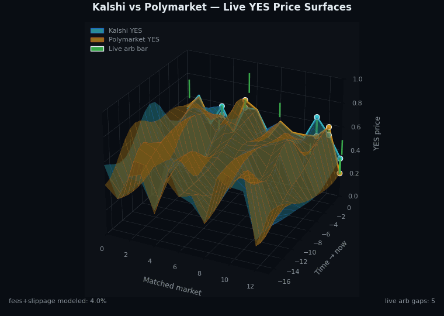

# Polymarket-Kalshi Arbitrage Bot

A sophisticated arbitrage trading bot that identifies and exploits price discrepancies between **Kalshi** and **Polymarket** prediction markets. Features a beautiful terminal-style web interface with real-time updates and Web3 wallet integration.


## 3D Arbitrage Surface

Two live YES‑price surfaces in the same 3D plot — **cyan = Kalshi**, **amber = Polymarket** — plotted across matched markets (X) and a sliding time window (Y → now). The vertical gap between the two ribbons at any (market, time) is the cross‑platform arbitrage edge; the green bars on the "now" edge highlight markets whose Kalshi vs Polymarket spread currently exceeds the actionable threshold.

The camera is fixed; the surfaces themselves scroll forward in time so each frame represents the latest tape from both venues. Where the ribbons hug each other there is no arbitrage; where they pull apart, there is an opportunity.

<p align="center">
  
</p>

The animation is regenerated automatically after every market scan and served from `/assets/arbitrage_surface.gif`. To re-render manually:

```bash
python -m src.viz.arbitrage_surface
```

## Table of Contents

- [3D Arbitrage Surface](#3d-arbitrage-surface)
- [Features](#features)
- [How It Works](#how-it-works)
- [Architecture](#architecture)
- [Installation](#installation)
- [Configuration](#configuration)
- [Usage](#usage)
- [Web Interface](#web-interface)
- [API Reference](#api-reference)
- [Trading Strategies](#trading-strategies)
- [Risk Management](#risk-management)
- [Development](#development)
- [Troubleshooting](#troubleshooting)
- [Disclaimer](#disclaimer)
- [License](#license)

## Features

### Core Capabilities

- **Cross-Platform Market Matching**: Intelligent fuzzy matching algorithm to identify equivalent markets across Kalshi and Polymarket
- **Real-Time Arbitrage Detection**: Continuous scanning for price discrepancies with configurable profit thresholds
- **Automated Trade Execution**: Execute arbitrage trades across both platforms with a single click
- **Web3 Wallet Integration**: Connect MetaMask for Polymarket trading on Polygon network
- **Risk Assessment**: Built-in risk scoring for each opportunity based on liquidity, confidence, and market conditions

### Terminal Interface

- **Cyberpunk-Themed Design**: Beautiful dark terminal aesthetic with real-time updates
- **Live Market Data**: WebSocket-powered streaming of market prices and opportunities
- **Trade History**: Complete log of executed trades with P&L tracking
- **Interactive Filters**: Filter opportunities by minimum profit and maximum risk
- **3D Arbitrage Surface**: Animated GIF visualisation of the cross-platform edge landscape with live opportunities projected onto it (`/assets/arbitrage_surface.gif`)
- **Keyboard Shortcuts**: `Ctrl+S` to scan, `Esc` to close modals

### Technical Features

- **Async Architecture**: Built with `asyncio` and `aiohttp` for maximum performance
- **WebSocket Server**: Real-time bidirectional communication using Flask-SocketIO
- **Modular Design**: Clean separation of concerns with dedicated modules for each function
- **Dry Run Mode**: Test strategies without risking real funds
- **Comprehensive Logging**: Detailed logs for debugging and audit trails

## How It Works

### Arbitrage Opportunity

Arbitrage occurs when the same event is priced differently across platforms:

```
Example:
┌─────────────────────────────────────────────────────────────┐
│ Market: "Will candidate X win the election?"                │
├─────────────────┬─────────────────┬─────────────────────────┤
│    Platform     │   YES Price     │      NO Price           │
├─────────────────┼─────────────────┼─────────────────────────┤
│    Kalshi       │     $0.45       │       $0.55             │
│    Polymarket   │     $0.48       │       $0.52             │
├─────────────────┴─────────────────┴─────────────────────────┤
│ Arbitrage: Buy YES on Kalshi @ $0.45                        │
│            Sell YES on Polymarket @ $0.48                   │
│            Profit: $0.03 per contract (6.67%)               │
└─────────────────────────────────────────────────────────────┘
```

### Process Flow

```
┌──────────────┐    ┌──────────────┐    ┌──────────────┐
│   Fetch      │───>│    Match     │───>│   Detect     │
│   Markets    │    │   Markets    │    │  Arbitrage   │
└──────────────┘    └──────────────┘    └──────────────┘
       │                   │                   │
       v                   v                   v
┌──────────────┐    ┌──────────────┐    ┌──────────────┐
│   Kalshi     │    │    Fuzzy     │    │   Calculate  │
│   API        │    │   Matching   │    │   Profits    │
└──────────────┘    └──────────────┘    └──────────────┘
       │                   │                   │
       v                   v                   v
┌──────────────┐    ┌──────────────┐    ┌──────────────┐
│  Polymarket  │    │   Keyword    │    │    Risk      │
│   API        │    │  Extraction  │    │   Scoring    │
└──────────────┘    └──────────────┘    └──────────────┘
                                               │
                                               v
                                        ┌──────────────┐
                                        │   Execute    │
                                        │   Trades     │
                                        └──────────────┘
```

## Architecture

```
polymarket-kalshi-arbitrage/
├── main.py                 # CLI entry point
├── requirements.txt        # Python dependencies
├── .env.example           # Environment template
├── .gitignore
│
├── src/
│   ├── __init__.py
│   │
│   ├── api/               # API Clients
│   │   ├── __init__.py
│   │   ├── kalshi_client.py      # Kalshi Trading API v2
│   │   └── polymarket_client.py  # Polymarket CLOB + Gamma API
│   │
│   ├── core/              # Business Logic
│   │   ├── __init__.py
│   │   ├── market_matcher.py     # Fuzzy market matching
│   │   ├── arbitrage_detector.py # Opportunity detection
│   │   └── trade_executor.py     # Trade execution
│   │
│   ├── utils/             # Utilities
│   │   ├── __init__.py
│   │   ├── config.py      # Configuration management
│   │   └── logger.py      # Logging setup
│   │
│   └── server.py          # Flask + SocketIO server
│
├── frontend/              # Web Interface
│   ├── index.html         # Main terminal UI
│   ├── css/
│   │   └── terminal.css   # Cyberpunk styling
│   └── js/
│       └── app.js         # Frontend application
│
└── tests/                 # Test suite
    └── ...
```

## Installation

### Prerequisites

- Python 3.9 or higher
- Node.js (optional, for frontend development)
- MetaMask browser extension (for Polymarket trading)
- Kalshi account with API access
- Polygon wallet with USDC (for Polymarket)

### Quick Start

```bash
# Clone the repository
git clone https://github.com/yourusername/polymarket-kalshi-arbitrage.git
cd polymarket-kalshi-arbitrage

# Create virtual environment
python -m venv venv
source venv/bin/activate  # On Windows: venv\Scripts\activate

# Install dependencies
pip install -r requirements.txt

# Copy environment template
cp .env.example .env

# Edit configuration
nano .env  # or use your preferred editor

# Start the server
python main.py server
```

### Docker Installation (Optional)

```dockerfile
# Dockerfile
FROM python:3.11-slim

WORKDIR /app
COPY requirements.txt .
RUN pip install --no-cache-dir -r requirements.txt

COPY . .
EXPOSE 8080

CMD ["python", "main.py", "server"]
```

```bash
# Build and run
docker build -t arbitrage-bot .
docker run -p 8080:8080 --env-file .env arbitrage-bot
```

## Configuration

### Environment Variables

Create a `.env` file based on `.env.example`:

```bash
# ===========================================
# Kalshi Configuration
# ===========================================
# Get your API key from: https://kalshi.com/settings/api
KALSHI_API_KEY=your_kalshi_api_key
KALSHI_API_SECRET=your_kalshi_api_secret
KALSHI_DEMO_MODE=false

# ===========================================
# Polymarket Configuration
# ===========================================
# Polymarket uses wallet-based authentication
# Private key is optional - you can use MetaMask in the UI
POLYMARKET_PRIVATE_KEY=your_wallet_private_key

# ===========================================
# Web3 Configuration
# ===========================================
# Polygon RPC URL (get from Alchemy, Infura, or use public)
WEB3_PROVIDER_URL=https://polygon-rpc.com
POLYGON_CHAIN_ID=137

# ===========================================
# Trading Configuration
# ===========================================
MIN_ARBITRAGE_PROFIT_PCT=1.0    # Minimum profit % to report
MAX_TRADE_SIZE_USD=100          # Maximum single trade size
MAX_POSITION_USD=1000           # Maximum total position
AUTO_TRADE_ENABLED=false        # Enable automatic trading
DRY_RUN=true                    # Simulate trades without execution

# ===========================================
# Server Configuration
# ===========================================
HOST=0.0.0.0
PORT=8080
DEBUG=false

# ===========================================
# Logging
# ===========================================
LOG_LEVEL=INFO
LOG_FILE=logs/arbitrage.log
```

### Getting API Keys

#### Kalshi

1. Create account at [kalshi.com](https://kalshi.com)
2. Complete identity verification
3. Go to Settings > API
4. Generate new API key pair
5. Store securely - the secret is only shown once!

#### Polymarket

Polymarket uses Web3 wallet authentication:

1. Install MetaMask browser extension
2. Create or import a wallet
3. Add Polygon network to MetaMask
4. Fund wallet with MATIC (for gas) and USDC (for trading)
5. Connect wallet through the web interface

## Usage

### Command Line Interface

```bash
# Start the web server (default)
python main.py server

# Start on custom port
python main.py server --port 3000

# Enable live trading (disable dry run)
python main.py server --live

# Run a one-time market scan
python main.py scan

# Scan with custom parameters
python main.py scan --min-profit 2.0 --threshold 70

# Output scan results as JSON
python main.py scan --output json

# Get help
python main.py --help
```

### Web Interface

1. Open browser to `http://localhost:8080`
2. Connect your wallets:
   - Click "Connect Account" for Kalshi (API key)
   - Click "Connect Wallet" for Polymarket (MetaMask)
3. Click "Start Scan" to fetch markets and detect opportunities
4. Review opportunities in the center panel
5. Click "Execute Trade" on any opportunity
6. Confirm trade details in the modal
7. Monitor execution in the terminal output

### Keyboard Shortcuts

| Shortcut | Action |
|----------|--------|
| `Ctrl+S` | Start market scan |
| `Esc` | Close modal |

## Web Interface

### Terminal Layout

```
┌─────────────────────────────────────────────────────────────────────────┐
│ ● ● ●  Polymarket-Kalshi Arbitrage Terminal v1.0.0    ◉ Connected  12:34│
├─────────────────────┬───────────────────────────┬───────────────────────┤
│  WALLET CONNECTION  │   ARBITRAGE OPPORTUNITIES │    TRADING STATS      │
│  ─────────────────  │   ───────────────────────│    ──────────────      │
│  KALSHI    [Connect]│   ┌─────────────────────┐ │    Total P&L: $0.00   │
│  POLYMARKET[Connect]│   │ ARB-000001   +2.45% │ │    Win Rate:  0%      │
│                     │   │ Market title...     │ │    Trades:    0       │
│  SCANNER CONTROLS   │   │ BUY: KALSHI  @ 0.45 │ │    Avg Profit: 0%     │
│  ─────────────────  │   │ SELL: POLY   @ 0.48 │ │                       │
│  [▶ Start Scan]     │   │ [Execute Trade]     │ │    RECENT TRADES      │
│  [↻ Refresh]        │   └─────────────────────┘ │    ─────────────      │
│  Progress: Ready    │                           │    (none)             │
│                     │   ┌─────────────────────┐ │                       │
│  MATCHED MARKETS    │   │ ARB-000002   +1.89% │ │    TERMINAL           │
│  ────────────────── │   │ ...                 │ │    ────────           │
│  Market | K | P | Δ │   └─────────────────────┘ │    [12:34] Connected  │
│  ...    |.45|.48|.03│                           │    [12:34] Scanning...│
└─────────────────────┴───────────────────────────┴───────────────────────┘
│ DRY RUN MODE          Last update: 12:34:56          ◉ Polygon Mainnet  │
└─────────────────────────────────────────────────────────────────────────┘
```

### Features

- **Real-time Updates**: All data streams via WebSocket
- **Responsive Design**: Works on desktop and tablet
- **Dark Theme**: Easy on the eyes for extended monitoring
- **Status Indicators**: Connection, wallet, and network status

## API Reference

### REST Endpoints

| Endpoint | Method | Description |
|----------|--------|-------------|
| `/api/status` | GET | Server status and configuration |
| `/api/markets` | GET | Get matched markets |
| `/api/opportunities` | GET | Get arbitrage opportunities |
| `/api/trades` | GET | Get trade history |
| `/api/execute` | POST | Execute a trade |
| `/api/scan` | POST | Trigger market scan |

### WebSocket Events

#### Client → Server

| Event | Payload | Description |
|-------|---------|-------------|
| `wallet_connect` | `{address, chainId, platform}` | Connect wallet |
| `wallet_disconnect` | `{address}` | Disconnect wallet |
| `subscribe_markets` | - | Subscribe to market updates |
| `subscribe_opportunities` | - | Subscribe to opportunity updates |
| `execute_opportunity` | `{opportunity_id, size_usd}` | Execute trade |
| `start_scan` | - | Start market scan |

#### Server → Client

| Event | Payload | Description |
|-------|---------|-------------|
| `connected` | `{status, session_id}` | Connection confirmed |
| `markets_update` | `{markets[], count}` | Market data update |
| `opportunities_update` | `{opportunities[], stats}` | Opportunities update |
| `trade_executed` | `{trade}` | Trade execution result |
| `scan_progress` | `{stage, progress, message}` | Scan progress update |
| `scan_complete` | `{matched_markets, opportunities}` | Scan finished |

## Trading Strategies

### Cross-Platform YES Arbitrage

Buy YES on cheaper platform, sell on more expensive:

```python
if polymarket_yes_price > kalshi_yes_ask:
    buy("kalshi", "YES", kalshi_yes_ask)
    sell("polymarket", "YES", polymarket_yes_price)
    profit = polymarket_yes_price - kalshi_yes_ask - fees
```

### Cross-Platform NO Arbitrage

Same strategy for NO outcomes:

```python
if kalshi_no_bid > polymarket_no_price:
    buy("polymarket", "NO", polymarket_no_price)
    sell("kalshi", "NO", kalshi_no_bid)
    profit = kalshi_no_bid - polymarket_no_price - fees
```

### Guaranteed Profit (Rare)

When prices are mispriced such that buying both YES and NO costs less than $1:

```python
total_cost = min_yes_price + min_no_price
if total_cost < 1.0:
    buy_both_sides()
    guaranteed_profit = 1.0 - total_cost - fees
```

## Risk Management

### Built-in Protections

1. **Dry Run Mode**: Default enabled - simulates trades without execution
2. **Max Trade Size**: Configurable limit per trade (default: $100)
3. **Max Position**: Total position limit (default: $1000)
4. **Risk Scoring**: Each opportunity scored 0-100 based on:
   - Match confidence (similarity score)
   - Liquidity (combined volume)
   - Anomaly detection (suspiciously high profits)

### Risk Factors to Consider

| Risk | Mitigation |
|------|------------|
| **Market Mismatch** | High similarity threshold, manual review |
| **Execution Risk** | Limit orders, slippage buffers |
| **Liquidity Risk** | Minimum volume requirements |
| **Timing Risk** | Fast execution, price refresh |
| **Platform Risk** | Diversification, position limits |
| **Regulatory Risk** | Compliance with platform ToS |

### Recommended Settings for Beginners

```bash
MIN_ARBITRAGE_PROFIT_PCT=2.0   # Higher threshold = fewer but safer trades
MAX_TRADE_SIZE_USD=50          # Start small
DRY_RUN=true                   # Always test first!
```

## Development

### Setting Up Development Environment

```bash
# Clone and setup
git clone https://github.com/yourusername/polymarket-kalshi-arbitrage.git
cd polymarket-kalshi-arbitrage

# Create virtual environment
python -m venv venv
source venv/bin/activate

# Install dev dependencies
pip install -r requirements.txt
pip install pytest pytest-asyncio black flake8

# Run tests
pytest tests/

# Format code
black src/

# Lint
flake8 src/
```

### Project Structure

```
src/
├── api/           # External API integrations
├── core/          # Business logic
├── utils/         # Shared utilities
└── server.py      # Web server
```

### Adding New Features

1. **New API Client**: Add to `src/api/`
2. **New Detection Strategy**: Extend `ArbitrageDetector`
3. **New UI Component**: Update `frontend/`

## Troubleshooting

### Common Issues

#### "Connection refused" error

```bash
# Check if server is running
curl http://localhost:8080/api/status

# Check port availability
lsof -i :8080
```

#### "No markets found"

- Verify API credentials in `.env`
- Check network connectivity
- Kalshi may be rate limiting - wait and retry

#### "MetaMask not detected"

- Install MetaMask browser extension
- Refresh the page
- Check browser console for errors

#### "Insufficient funds"

- Ensure wallet has MATIC for gas
- Ensure wallet has USDC for trading
- Check Polygon network connection

### Logs

```bash
# View live logs
tail -f logs/arbitrage.log

# Debug mode
python main.py server --debug
```

### Getting Help

1. Check the [Issues](https://github.com/yourusername/polymarket-kalshi-arbitrage/issues)
2. Review logs for error messages
3. Open a new issue with:
   - Error message
   - Steps to reproduce
   - Environment details

## Disclaimer

**IMPORTANT: READ BEFORE USING**

This software is provided for **educational and research purposes only**.

- **Not Financial Advice**: This bot does not constitute financial advice. Trading prediction markets involves significant risk.
- **No Guarantees**: Past performance does not indicate future results. Arbitrage opportunities may disappear before execution.
- **Use at Your Own Risk**: The authors are not responsible for any financial losses incurred through use of this software.
- **Regulatory Compliance**: Ensure you comply with all applicable laws and regulations in your jurisdiction.
- **Platform Terms**: Review and comply with Kalshi and Polymarket terms of service.

By using this software, you acknowledge that:
1. You understand the risks involved in prediction market trading
2. You are solely responsible for your trading decisions
3. You will start with small amounts and use dry run mode for testing

## License

MIT License

Copyright (c) 2024

Permission is hereby granted, free of charge, to any person obtaining a copy
of this software and associated documentation files (the "Software"), to deal
in the Software without restriction, including without limitation the rights
to use, copy, modify, merge, publish, distribute, sublicense, and/or sell
copies of the Software, and to permit persons to whom the Software is
furnished to do so, subject to the following conditions:

The above copyright notice and this permission notice shall be included in all
copies or substantial portions of the Software.

THE SOFTWARE IS PROVIDED "AS IS", WITHOUT WARRANTY OF ANY KIND, EXPRESS OR
IMPLIED, INCLUDING BUT NOT LIMITED TO THE WARRANTIES OF MERCHANTABILITY,
FITNESS FOR A PARTICULAR PURPOSE AND NONINFRINGEMENT. IN NO EVENT SHALL THE
AUTHORS OR COPYRIGHT HOLDERS BE LIABLE FOR ANY CLAIM, DAMAGES OR OTHER
LIABILITY, WHETHER IN AN ACTION OF CONTRACT, TORT OR OTHERWISE, ARISING FROM,
OUT OF OR IN CONNECTION WITH THE SOFTWARE OR THE USE OR OTHER DEALINGS IN THE
SOFTWARE.

---

**Built with care by developers who love prediction markets**

Questions? Issues? PRs welcome!
